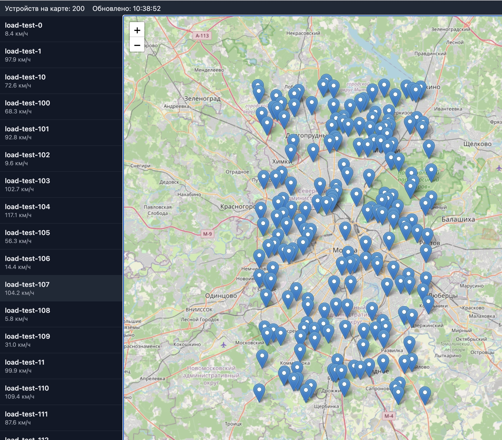
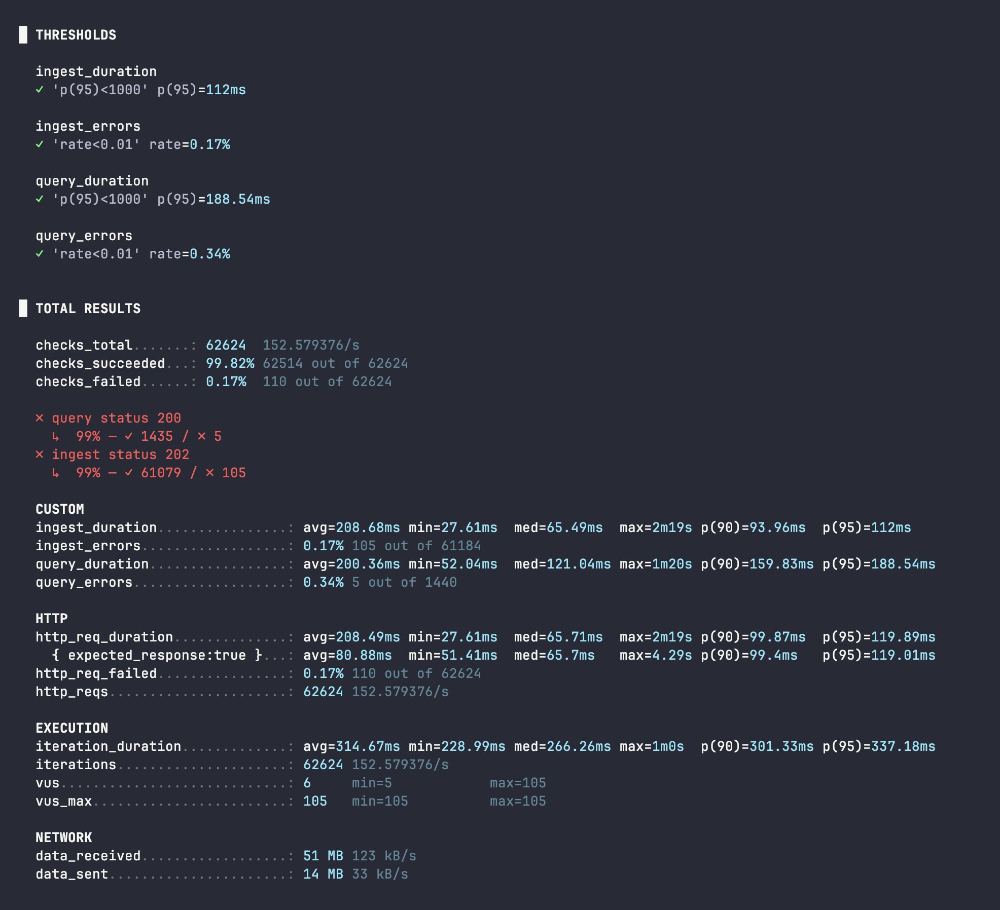
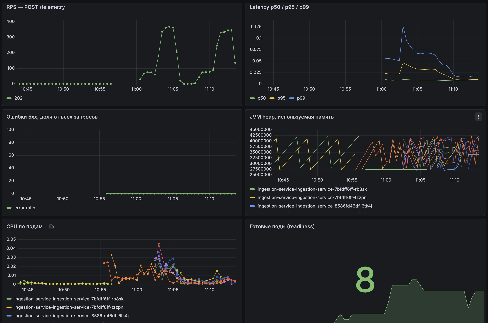
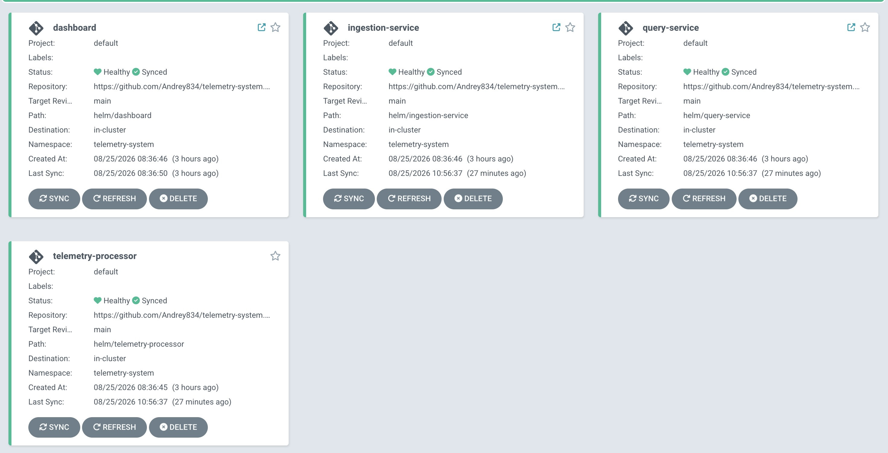

# Telemetry System


Приём и обработка телеметрии от парка транспортных средств/датчиков в реальном времени —
портфолио-проект, реализующий архитектуру, описанную ниже, плюс живой дашборд слежения за парком.

Живая карта устройств (Angular + Leaflet), 200 устройств из нагрузочного теста на карте:



## Возможности дашборда

- **Живая карта** — кластеризация маркеров (`leaflet.markercluster`), тёмные/светлые тайлы
  (CARTO), heatmap плотности, попапы с быстрым доступом к маршруту и сравнению
- **Push вместо поллинга** — обновления по SSE поверх `fetch` с ручным разбором потока (нативный
  `EventSource` не умеет `Authorization`-заголовок, а весь проект аутентифицируется JWT-Bearer)
- **Плеер маршрута** — прокрутка истории конкретного устройства по времени, отдельным маркером
- **Журнал событий** — офлайн/онлайн-переходы вычисляются на лету оконным SQL (`LAG()`) по уже
  существующей истории телеметрии — без новой таблицы и без живого детектора, дублирующего записи
  между репликами `query-service`
- **Аналитика парка** — статусы онлайн/устарело/офлайн, скорость и сравнение нескольких устройств
  на одном графике, гистограмма скоростей, статусы по группам, активность парка во времени
- **Регистрация и управление устройствами** (роль ADMIN) — выдача API-ключа один раз, переименование,
  деактивация без удаления истории
- **JWT-авторизация с ролями** ADMIN/OPERATOR
- **Светлая/тёмная тема** на единой системе design-токенов (Tailwind v4 `@theme inline`) — цвета
  переключаются через CSS-переменные, без `dark:`-варианта на каждом классе в каждом шаблоне

## Архитектура

```
Датчики → ingestion-service → Kafka (partition key = deviceId) → telemetry-processor
                                                                        │
                                                    ┌───────────────────┴──────────────────┐
                                                    ▼                                       ▼
                                                  Redis                                 PostgreSQL
                                            (текущее состояние)                     (история, Timescale)
                                                    │                                       │
                                                    ▼                                       ▼
                                          query-service → dashboard              ETA-модель / аналитика
                                          (live API)      (Angular + Leaflet)
```

Ключевые решения:
- **Партиционирование Kafka по `deviceId`**, а не round-robin — сохраняет порядок координат
  внутри одного устройства, при этом разные устройства обрабатываются параллельно.
- **Два разных хранилища под разные паттерны доступа**: Redis — точечный upsert текущего
  состояния с высокой частотой перезаписи; PostgreSQL — append-only история для агрегаций.

## Статус

| Сервис | Статус |
|---|---|
| `ingestion-service` | ✅ реализован — WebFlux REST-эндпоинт, API-key авторизация устройств, публикация в Kafka |
| `telemetry-processor` | ✅ реализован — Kafka consumer group, запись в Redis + PostgreSQL |
| `query-service` (live API) | ✅ реализован — WebFlux, JWT-авторизация с ролями ADMIN/OPERATOR, SSE-стрим, чтение из Redis + read-реплики Postgres, запись реестра устройств через отдельный primary-коннектор |
| `dashboard` (live-карта) | ✅ реализован — Angular + Leaflet + Tailwind, JWT-логин, живая карта с кластеризацией и heatmap, плеер маршрута, журнал событий, аналитика (Chart.js), управление устройствами, светлая/тёмная тема |

## Стек

Java 25, Spring Boot 4.1 (WebFlux), Spring Kafka (`ingestion-service`) и reactor-kafka
(`telemetry-processor`, полностью неблокирующий Kafka I/O), R2DBC + Flyway, Reactive Redis,
Spring Security + JWT с ролями ADMIN/OPERATOR (`query-service` — логин dashboard, API-key поверх
SHA-256 — `ingestion-service` для устройств), Server-Sent Events поверх `Flux` для живых обновлений
дашборда без поллинга, read-реплика PostgreSQL под чтение (реестр устройств, история маршрута) и
отдельный primary-коннектор под запись реестра, отдельно от write-пути `telemetry-processor`,
Angular 22 (standalone, signals) + Leaflet/OpenStreetMap (`leaflet.markercluster`, `leaflet.heat`) +
Tailwind CSS v4 (design-токены, светлая/тёмная тема) + Chart.js (`dashboard`), Docker Compose, Helm,
Terraform (Yandex Cloud), ArgoCD (GitOps), Prometheus/Grafana, cert-manager + ingress-nginx (HTTPS).

## Локальный запуск

```bash
docker compose up -d kafka-1 kafka-2 kafka-3 redis postgres
cd ingestion-service && mvn spring-boot:run
# в отдельном терминале
cd telemetry-processor && mvn spring-boot:run
# в отдельном терминале
cd query-service && mvn spring-boot:run
# в отдельном терминале
cd dashboard && npm install && npm start   # http://localhost:4200
```

Kafka поднимается в режиме KRaft тремя нодами с полноценным кворумом (`replication-factor=3`,
`min.insync.replicas=2`) — кластер переживает падение одной ноды из трёх без потери данных и
без остановки записи, а не одна нода "для галочки".

Проверка:
```bash
curl -X POST localhost:8080/telemetry \
  -H 'Content-Type: application/json' \
  -d '{"deviceId":"bus-42","routeId":7,"lat":55.751244,"lon":37.618423,"speedKmh":38.5,"timestamp":"2026-08-20T12:00:00Z"}'

# состояние устройства в Redis
docker exec telemetry-redis redis-cli GET telemetry:state:bus-42

# история в PostgreSQL
docker exec telemetry-postgres psql -U telemetry -d telemetry -c \
  "SELECT device_id, lat, lon, recorded_at FROM telemetry_history ORDER BY id DESC LIMIT 5;"

# текущее состояние через live API
curl "localhost:8082/devices/bus-42"
curl "localhost:8082/devices?ids=bus-42,bus-1"

# живая карта — откройте в браузере
open http://localhost:4200
```

Через `docker compose up -d` поднимаются все сервисы разом, включая `dashboard` (Angular,
собранный и отданный через nginx, `http://localhost:4200`) — URL `query-service` передаётся ему
не на этапе сборки образа, а через переменную окружения `QUERY_SERVICE_URL` при старте контейнера
(entrypoint-скрипт генерирует `env.js` через `envsubst`), поэтому один и тот же образ годится и
для docker-compose, и для прод-кластера с другим доменом — не нужно пересобирать под каждое окружение.

## Helm

Чарты — `helm/ingestion-service`, `helm/telemetry-processor`, `helm/query-service`,
`helm/dashboard`. По мере добавления сервисов сюда добавятся соседние чарты (или объединятся
в umbrella-чарт, если разрастётся).

```bash
helm install ingestion-service ./helm/ingestion-service \
  --set image.repository=<your-registry>/ingestion-service \
  --set env.kafkaBootstrapServers=kafka:9092

helm install telemetry-processor ./helm/telemetry-processor \
  --set image.repository=<your-registry>/telemetry-processor \
  --set env.kafkaBootstrapServers=kafka:9092

helm install query-service ./helm/query-service \
  --set image.repository=<your-registry>/query-service \
  --set env.corsAllowedOrigins=https://dashboard.telemetry.example.com

helm install dashboard ./helm/dashboard \
  --set image.repository=<your-registry>/dashboard \
  --set env.queryServiceUrl=https://query.telemetry.example.com
```

## Нагрузочное тестирование

Сценарий — `load-test/telemetry-load.js` (k6): до 100 виртуальных пользователей шлют телеметрию
в `ingestion-service` (нарастающая нагрузка, 0→20→100 VU), параллельно 5 VU опрашивают
`query-service` — эмуляция открытого dashboard, как в реальном использовании.

```bash
k6 run load-test/telemetry-load.js
```

Результат прогона на бою (Yandex Cloud, пик 105 VU, ~6.8 минут):

| Метрика | Значение |
|---|---|
| Запросов всего | 62 624 (~153/сек) |
| Успешность | 99.82% |
| p95 задержки, ingest | 112 мс |
| p95 задержки, query | 189 мс |

При этом Kubernetes HPA автоматически масштабировал поды сервисов под нагрузку и обратно после
её спада — без ручного вмешательства (видно на графике "Готовые поды" ниже: рост до 8 реплик
на пике и откат после).



Дашборд `ingestion-service` в Grafana во время того же прогона — RPS, latency-перцентили,
ошибки, память JVM, CPU по подам и число готовых подов:



## Продакшн-инфраструктура (Yandex Cloud)

Terraform в `terraform/` поднимает всё, что нужно для реального прод-окружения — но **двумя
отдельными конфигами с раздельным state**, а не одним `apply`:

- `terraform/infra/` — сеть с security group под требования Managed Kubernetes, статический
  публичный IP, Container Registry, сам кластер (3 воркер-ноды).
- `terraform/platform/` — bootstrap платформенных сервисов в уже существующий кластер
  (Prometheus/Grafana, ArgoCD, ingress-nginx, cert-manager), находит кластер через
  `data "yandex_kubernetes_cluster"` по имени.

Разделение не случайно: если создавать Managed Kubernetes-кластер и разворачивать в него ресурсы
через kubernetes/helm-провайдеры в одном apply/state, providers.tf вычисляет host/token ещё до
того, как кластер реально существует и API-сервер стабилизировался, — это приводит к `connection
refused`/`i/o timeout` при подключении к API сразу после создания кластера (воспроизведено
многократно). HashiCorp прямо не рекомендует так делать; решение — два independent apply.

```bash
# Стадия 1 — инфраструктура и кластер
cd terraform/infra
cp terraform.tfvars.example terraform.tfvars   # заполнить cloud_id/folder_id, не коммитить
export TF_VAR_yc_token=$(yc iam create-token)   # именно TF_VAR_-префикс, просто YC_TOKEN Terraform не читает

terraform init
terraform plan     # обязательно проверить план перед apply — часть Yandex-специфичных
                    # деталей (аннотация статического IP на LoadBalancer, формат
                    # cluster_ca_certificate) стоит сверить с актуальной документацией
                    # yandex-cloud/yandex на момент применения, а не доверять вслепую
terraform apply

# Стадия 2 — платформенные сервисы в уже стабильный кластер
cd ../platform
cp terraform.tfvars.example terraform.tfvars   # cluster_name/cloud_id/folder_id — те же, что в infra/
export TF_VAR_yc_token=$(yc iam create-token)

terraform init
terraform plan
terraform apply
```

После `apply` обеих стадий:

```bash
# доступ kubectl/helm к кластеру
$(cd terraform/infra && terraform output -raw kubeconfig_command)

# один раз — включить GitOps-деплой всех сервисов через ArgoCD
kubectl apply -f ../argocd/application.yaml
kubectl apply -f ../argocd/telemetry-processor.yaml
kubectl apply -f ../argocd/query-service.yaml
kubectl apply -f ../argocd/dashboard.yaml

# один раз — выпуск HTTPS-сертификатов (сначала staging, проверить, потом prod)
kubectl apply -f ../cert-manager/cluster-issuer.yaml

# доступ к UI без Ingress, для проверки
$(cd terraform/platform && terraform output -raw argocd_port_forward_command)
$(cd terraform/platform && terraform output -raw grafana_port_forward_command)
```

Дальше — **сервисы больше не деплоятся через `helm install` руками**: любой коммит в
`helm/ingestion-service`, `helm/telemetry-processor`, `helm/query-service` или `helm/dashboard`
(новый образ, новые values) синхронизируется ArgoCD автоматически. `terraform apply` повторно
нужен только при изменении самой инфраструктуры (`terraform/infra/`) или платформенных сервисов
(`terraform/platform/`), не при каждом релизе приложения.



Мониторинговые дашборды Grafana (не путать с Angular-приложением `dashboard`) для бэкенд-сервисов
разворачиваются **автоматически**, без единого ручного шага: каждый лежит в
`helm/<сервис>/dashboards/`, чарт оборачивает его в ConfigMap с лейблом `grafana_dashboard: "1"`
(`templates/dashboard-configmap.yaml`), а sidecar Grafana (включён в платформенном модуле
Terraform, `searchNamespace: ALL`) сам находит и подхватывает эти ConfigMap в любом namespace при
каждом ArgoCD-синке — новый релиз приложения = обновлённый дашборд, без захода в UI Grafana руками.
